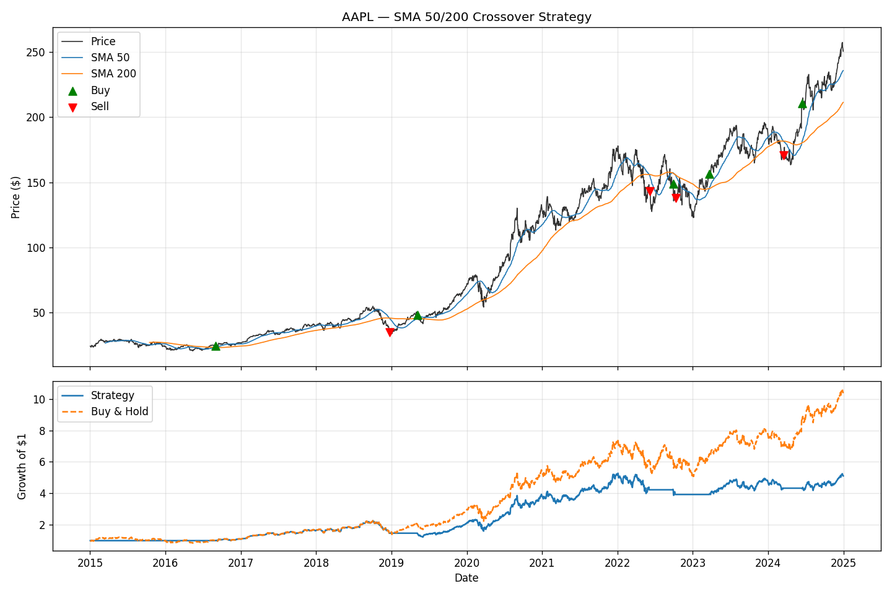

# 📈 Moving-Average Crossover Backtester

A clean, honest backtesting engine that tests a classic **SMA crossover**
trading strategy against a simple buy & hold benchmark written in Python
with `pandas`, `numpy`, and `yfinance`.

Built as a learning project at the intersection of **machine learning,
quantitative finance, and economics**, where I'm focused as an AI &
Quantitative Economics student at the University at Buffalo.



> *Example: AAPL with a 50/200-day SMA crossover. Green/red markers show
> entries and exits; the bottom panel compares strategy equity vs. buy & hold.*

---

## The strategy

A textbook trend following rule:

- **Go long** when the short moving average rises above the long moving average.
- **Go to cash** when it falls back below.

It's deliberately simple the point isn't to beat the market, it's to build
a backtesting framework that's **methodologically correct** and to measure
honestly whether a rule adds value.

### What it does right
- **No look ahead bias.** Signals are computed on day *t* but acted on day
  *t+1* (`signal.shift(1)`), so the backtest never trades on information it
  couldn't have known in real time.
- **Fair benchmark.** Every result is shown next to buy & hold, because a
  strategy that underperforms just holding the stock isn't actually good.
- **Risk-adjusted metrics.** Reports CAGR, annualized Sharpe ratio, and max
  drawdown  not just total return.

---

## Quick start

```bash
# 1. Install dependencies
pip install -r requirements.txt

# 2. Run the default backtest (AAPL, 50/200 SMA, since 2015)
python backtester.py

# 3. Try your own parameters
python backtester.py --ticker MSFT --start 2010-01-01 --short 20 --long 100
```

### Options

| Flag       | Default      | Description                        |
|------------|--------------|------------------------------------|
| `--ticker` | `AAPL`       | Stock symbol                       |
| `--start`  | `2015-01-01` | Start date (`YYYY-MM-DD`)          |
| `--end`    | today        | End date                           |
| `--short`  | `50`         | Short SMA window (days)            |
| `--long`   | `200`        | Long SMA window (days)             |
| `--out`    | `backtest.png` | Output chart filename            |

### Sample output

```
AAPL  |  SMA 50/200  |  2015-01-02 → 2024-12-30
------------------------------------------------
Metric                Strategy    Buy & Hold
------------------------------------------------
Total return            410.9%        935.8%
CAGR                     17.8%         26.4%
Sharpe                    0.81          0.97
Max drawdown            -45.6%        -38.5%
------------------------------------------------
```

*(Numbers depend on ticker and dates. The honest takeaway here: over this
period the crossover strategy **underperformed** simply holding AAPL lower
return, similar drawdown. That's exactly the kind of result a correct backtest
is meant to surface, instead of a curve fit success story. The framework is
the deliverable; the strategy is just the first thing to test with it.)*

---

## What I learned building this
- Why **look-ahead bias** quietly inflates almost every naive backtest.
- That **risk-adjusted** return (Sharpe, drawdown) tells a very different story
  than headline return alone.
- How to structure a small, readable quant project: data → signal → execution
  → evaluation.

## Roadmap / next steps
- [ ] Add transaction costs and slippage
- [ ] Support short selling (long/short instead of long/flat)
- [ ] Parameter sweep to study overfitting across window sizes
- [ ] Swap the rule for an ML-based signal (logistic regression / gradient boosting)

---

*This is an educational project and **not** financial advice.*
